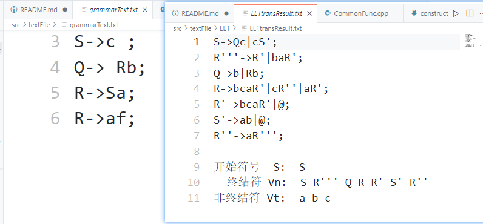
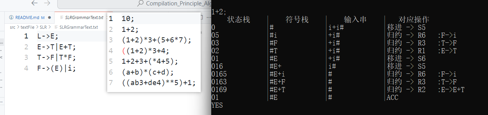

# 编译原理课程一系列实验的实现
1. 词法分析程序的设计
2. 文法的I/O
3. LL（1）文法构造
4. 语法分析程序的设计-自上而下(LL(1)分析)
5. 语法分析程序的设计-自下而上(SLR分析)
6. 逆波兰式的翻译和计算

## 配置
1. 报告/模块介绍见 
   - [实验报告/文档__./doc/report.doc](./doc/report.doc) 
2. 项目文件config（VS）
   - 在 .vcxproj文件中完成vs逻辑和物理文件的映射
   - 在 .vcxproj.filters 中配置文件在VS中的逻辑组织
   - [详细配置方式__见文档_./doc/config.md](./doc/config.md)
3. 使用
   - VS2022
   - STL操作+OOP封装

## 效果展示
### report1--词法分析

### report2--文法IO

### report3--LL1改造


包括 左递归消除＋提公因式</br>

可识别的结构包括
```C++
//直接左递归
A->Abc|d
//间接左递归
S->Qc|c|cab;
Q->Rb|b;
R->Sa|a;
//多组直接公因式
A->an|ab|c|cba|d
//隐含公因式
A->ad|Bc;
B->aA|bB;
```

### report4--LL1分析

### report5--SLR分析

### 最终实现对特定文法实现自上而下分析



```C++
//这是一个表达式的识别文法
  E->T|E+T;
  T->F|T*F;
  F->i|(E);
```

最终实现对表达式结构正误的识别
```C++
1+2;              //yes
(1+2)*3+(5+6*7);  //yes
((1+2)*3+4;       //no 
1+2+3+(*4+5);     //no
```

### report6--逆波兰式计算


## 改进
1. 文件管理略显潦草
   - [x] 头文件和源文件起码得分开
   - [x] 规范化各个实验的文件名 (如优)
   - [x] 不同后缀文件的位置(.h  .cpp  .txt)
      - VS提供的过滤器只是逻辑上分的，实际文件的包含关系需要在 .vcxproj中手动设置
      - 例如：右击新建.cpp项目(默认项目根下新建) -> 卸载项目 -> 修改.vcxproj中文件的路径为实际路径 -> 重新加载项目 
2. 用类思想封装 抽象
   - [x] 实验1-6的关联性是重合了部分公用数据结构和函数 可以抽象一下
   - [x] 使用不同的类，把不同的实验函数封装起来(现在方法直接暴露在源文件中)
3. ...
   - 用cpp新特性(移动、智能指针)来规范简化操作
   - 几个实验间的方法和结构间有联系，可以考虑 OOP用基类和虚函数再抽象一下
